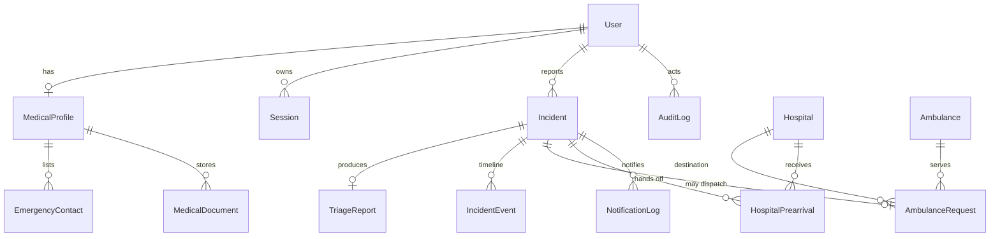

# Data Model

PostgreSQL via Prisma. Source of truth: [`apps/backend/prisma/schema.prisma`](../apps/backend/prisma/schema.prisma).
PII/PHI fields are AES-256-GCM encrypted at the application layer.

## Entity–relationship diagram



## Entities

| Model | Purpose | Notable fields |
|-------|---------|----------------|
| **User** | Identity & role | `role` (USER/RESPONDER/HOSPITAL_STAFF/ADMIN), `provider`, `isGuest`, `passwordHash` (argon2) |
| **Session** | Refresh-token-backed sessions (rotating) | `refreshTokenHash`, `expiresAt`, `revokedAt` |
| **MedicalProfile** | Clinical profile (1:1 with User) | `bloodGroup`, `allergies[]`, `medications[]`, `chronicConditions[]`, `insuranceInfo` *(encrypted)*, `qrToken` (public card) |
| **EmergencyContact** | People to alert | `priority`, `notifyBySms`, `notifyByCall` |
| **MedicalDocument** | Uploaded files | `storageKey` (→ storage adapter), `contentType`, `sizeBytes` |
| **Incident** | An SOS event | `status` (state machine), `severity`, lat/lng, `trackingToken` (public live link) |
| **TriageReport** | Immutable triage output (1:1) | `severity`, `confidence`, vitals, `recommendedActions[]`, `disclaimer`, `provider` — **never a diagnosis** |
| **IncidentEvent** | Append-only timeline | `type` (STATUS_CHANGE/NOTE/LOCATION_UPDATE/NOTIFICATION), `payload` |
| **Hospital** | Facility directory | lat/lng, `capabilities[]`, `rating`, `isOpen24h`, `availableBeds` |
| **Ambulance** | Fleet | `vehicleNumber`, `type` (BLS/ALS), `status`, lat/lng |
| **AmbulanceRequest** | Dispatch (opt. linked to an Incident) | `status`, `etaSeconds`, `distanceKm`, `destinationHospitalId` |
| **HospitalPrearrival** | Clinical hand-off snapshot | `status` (SENT/ACKNOWLEDGED/DECLINED), `payload` (denormalized), `etaSeconds` |
| **NotificationLog** | Comms audit | `channel` (PUSH/SMS/WHATSAPP/EMAIL/CALL), `status`, `provider` — **no message bodies** |
| **AuditLog** | Security audit trail | `action`, `resource`, `ip` — **no request bodies** |

## Incident state machine

```
DRAFT → ACTIVE → DISPATCHED → EN_ROUTE → AT_HOSPITAL → RESOLVED
   └────────┴──────────┴──────────┴─────────→ CANCELLED
```
Transitions are enforced server-side (`emergency/emergency.service.ts`);
illegal jumps are rejected with `400`.

## Migrations
Committed under `apps/backend/prisma/migrations/`. Apply with
`npm run prisma:deploy`. See the backend README for the non-interactive
migration workflow used in this project.
